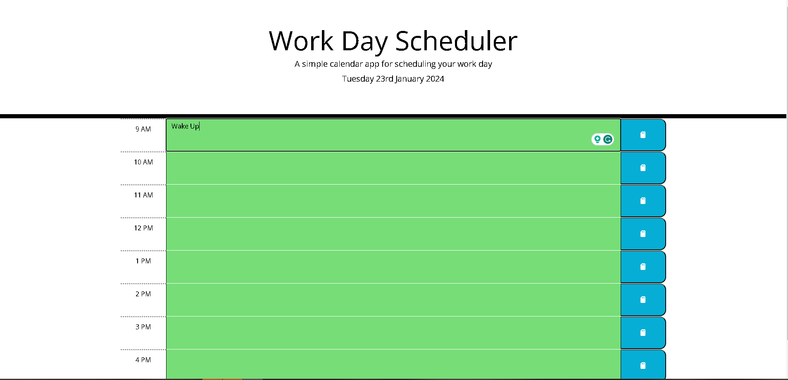

# 9-5 Work Day Scheduler 
## Description

9-5 Work Day Scheduler Link:  https://kaleims.github.io/9to5-Work-Scheduler/

This project was fascinating, and I thoroughly enjoyed researching dayjs. Although I was initially lost, I persevered and gained a deeper understanding. As a result, my skills in Javascript and Jquery have significantly improved, and I am now more confident than ever. Despite having a long way to go, I am determined to continue pushing myself and see how far I can go.

## Usage

Link to Scheduler:  https://kaleims.github.io/9to5-Work-Scheduler/

<b>Important Info: Depending on the time, each time-block/row fall into three different colors. 
 Future: Green
 Past: White/Grey
 Present: Red/Orange</b>

To use the Work Day Scheduler simply click in any of the boxes viewed in the image below, type relevent information into textarea and click the big blue save button on the right side of the textarea. After you've completed the first step, if you refresh the text you input will still be there.

    
## Credits

https://developer.mozilla.org/en-US/
 https://developer.mozilla.org/en-US/docs/Web/API/Window/localStorage
 https://day.js.org/
 https://fontawesome.com/

## License

MIT Licence
